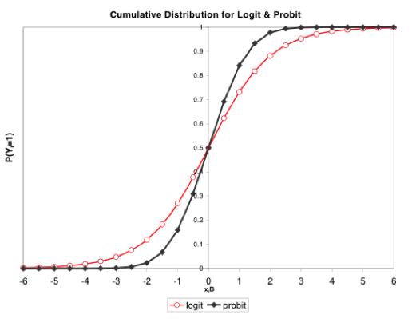

```{r setup, include=FALSE}
knitr::opts_chunk$set(echo = FALSE)
```

# Big Picture 

Other people have said that the prevalence of civil war is due to the end of the Cold War, higher ethnic or religious diversity, or strong ethnic or political grievances.  

----

# This paper argues that this is not true.  

Their Hypotheses

* “We hypothesize that financially, organizationally, and politically weak central governments render insurgency more feasible and attractive due to weak local policing or inept and corrupt counterinsurgency practices…. On the rebel side, insurgency is favored by rough terrain, rebels with local knowledge of the population superior to the government’s, and a large population” (76).

* To test this, Fearon and Laitin develop 11 hypotheses that they test in five models using 127 civil wars across 54 years (1945-1999).

----

# Methodology Selection

* All eleven hypotheses follow the format X  higher (or lower) risk of civil war onset

* We have a binary dependent variable (coded as “1” for all country-years in which a civil war started and “0” for all others) 

* OLS is inappropriate-- nonsense predictions, disturbances not normally distributed, heteroscedasticity exists, linearity assumption “suspect”

----

# 

----

# Logit Considers the Probability of success--


----

# Also worth noting: 

“Other approaches to the dependent variable and estimation- such as making the dependent variable “1” for all war years and using dynamic probit or Poisson models that interact independent variables with a lagged dependent variable… produce virtually identical results…. Using “rare events logit”… had no appreciable impact on any estimates reported” (82).

----

# Ethnic Diversity? Fearon and Laitin say, “No.”

* H1: higher ethnic or diversity  higher risk of civil war

* H2: with higher per capita income (as a proxy for economic modernization), the effect of higher diversity  higher risk of civil war (at increased level)

* H3: ethnic majority + significant ethnic minority  higher risk of civil war

* H7: higher ethnic diversity  higher risk of ethnic civil war

Results: No. 

----

# Coding: 

* H1

1. the commonly employed ethnolinguistic fractionalization (ELF) index 

2. a measure of the share of population belonging to the largest ethnic group 

3. the number of distinct languages spoken by groups exceeding 1% of the country’s population 

4. a measure of religious fractionalization (analogous to the ELF), constructed using data from the CIA Factbook and other sources

----

* H2

1. The measures from H1 interacted with per capita income. 

* H3

1. A dummy variable marking the 74 countries whose largest and second-largest ethnic groups exceed 49% and 7% of the population, respectively
[Alternative thresholds for the second-largest group, such as 10%, make no difference in the results (79)]

----

* H7

1. “ethnic” conflicts = conflicts in which the fighters were mobilized primarily along ethnic lines [coded 58 (51%) as ethnic, 20 (18%) as mixed or ambiguous, and 36 (32%) as not ethnic (excluding the anticolonial conflicts)]

----

# Democracy, Liberty, Equality? Fearon and Laitin say, “No.”

* H4: Democracy  lower risk of civil war

* H5: Lingual or religious discrimination  higher risk of civil war

* H6: Higher income inequality  higher risk of civil war

Results: No.

----

# Coding:

* H4

1. Polity IV

2. Przeworski et al. 2000 democracy measures

3. Freedom House indicator of the observance of civil liberties

----

# H5

1. For policies on language, coded by year whether a language spoken by at least 5% of the population received no official recognition at any level of government

2. For policies on religion, coded, by decade, indicators for whether the state: 

* had an official religion, 

* gave resources to one religion not available to others, 

* regulated missionary activities, 

* required religious groups to get official approval for religious activities, or 

* singled out for or permitted harassment of a particular religious group

# H6 

* Interpolated and extended as necessary the Gini coefficients assembled by Deininger and Squire (1996) 
[using the country-average of Gini values produced the same results]

*[note, for H5- “This non-result persists when we restrict the sample to those countries with at least a 5% religious or ethnic minority…. We tried the several religion indicators both separately and as a single measure based on a factor analysis of the components. Discrimination against regional languages is in fact associated with slightly lower odds of civil war onset” (85).] 

----

# Conditions that “favor insurgency” (young, poor, mountainous states)? Fearon and Laitin say, “Yes!”

* H8: rough terrain (+ cross-border sanctuaries + local population that can be induced not to denounce the insurgents to government age)  higher risk of civil war

* H9: higher per capita income  lower risk of civil war 
(Per capita income is a proxy for the relative weakness or strength of the insurgents—their odds of being killed or captured for a given level of counterinsurgent effort by the government

----

* H10: Potential rebels face or have available

(a) A newly independent state

(b) Political instability at the center, 

(c) A regime that mixes democratic with autocratic features, 

(d) A large country population, 

(e) A territorial base separated from the state’s center by water or distance

(f) Foreign governments or diasporas willing to supply weapons, money, or training 

(g) Land that supports the production of high- value, low-weight goods 

(h) A state whose revenues derive primarily from oil exports

----

* H11: with control for per capita income, effects of democracy, civil liberties, income inequality, and discriminatory policies on risk of civil war diminish

* Results: Yes! (more on this next)

* Coding:

* H8

(a) the proportion of the country that is “mountainous” according to the coding of geographer A. J. Gerard (note: “this does not pick up other sorts of rough terrain that can be favorable to guerrillas such as swamps and jungle, and it takes no account of population distributions or food availability in relation to mountains”)

* H9 

Penn World Tables and World Bank data on per capita income, estimating missing values using data on per capita energy consumption

----

* H10

(a) countries in their first and second years of independence

(b) a dummy variable indicating whether the country had a three-or- greater change on the Polity IV regime index in any of the three years prior to the country-year in question.

(c) regimes that score between −5 and 5 on the difference between Polity IV’s democracy and autocracy measures 

(d) population is based largely on World Bank figures. 

(e) dummy variable for states with noncontiguous territory

(h) country-years in which fuel exports exceeded one-third of export revenues, using World Bank data

----

* H11 

Previous measures with control for per capita income

